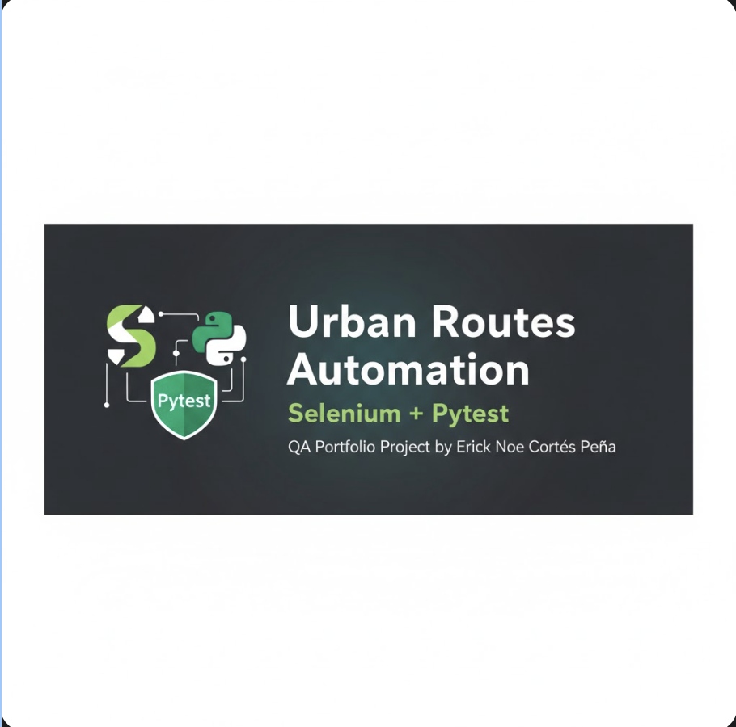

# 🧭 Urban Routes – End-to-End UI Automation Project  

  

---
This project demonstrates my approach to building stable, maintainable end-to-end UI automation for real-world applications, focusing on user flows, reliability, and clear test structure.

## 🚀 Project Overview  
Automated **end-to-end UI tests** for the Urban Routes web app.  
The suite validates the entire taxi-booking flow — from setting addresses to confirming the final order — ensuring a **stable, reliable, and user-friendly experience**.

**✅ Key Scenarios:**
1. Select *Comfort* tariff  
2. Add and confirm phone number (SMS code)  
3. Add a credit card for payment  
4. Send a message to the driver  
5. Toggle **Blanket & Tissues** option  
6. Add ice creams  
7. Confirm final request

---

## 🧰 Tech Stack
- 🐍 **Python 3.11+**
- 🌐 **Selenium WebDriver**
- ⚙️ **Pytest**
- 🧱 **Page Object Model (POM)**
- 🕒 **Explicit Waits**
- 🧩 **WebDriver Manager**
- 🧠 **Utils for SMS code retrieval & safe click helpers**

---
## Why this project matters

This automation suite focuses on critical user paths that directly impact user trust and business value, such as payments, confirmations, and optional add-ons.

The goal is not only to automate tests, but to prevent regressions in high-risk flows.

## 📂 Project Structure

qa-project-Urban-Routes-es/
├── data.py # Test data (URLs, addresses, cards)
├── urban_routes_page.py # Page Object Model (POM)
├── test_urban_routes.py # Test suite (Pytest)
├── utils.py # Helper functions
├── requirements.txt
└── README.md

## ⚙️ Setup & Run

### 1️⃣ Create a virtual environment
python -m venv .venv
source .venv/bin/activate  # macOS/Linux
# .venv\Scripts\activate.bat (Windows)

2️⃣ Install dependencies
pip install -r requirements.txt

3️⃣ Run all tests
pytest -v

*Erick Noé Cortés Peña*  
📍 Guadalajara, Jalisco, MX  
🔗 [LinkedIn](https://www.linkedin.com/in/erick-noe-cortes) | [GitHub](https://github.com/Erick-QAtest)

